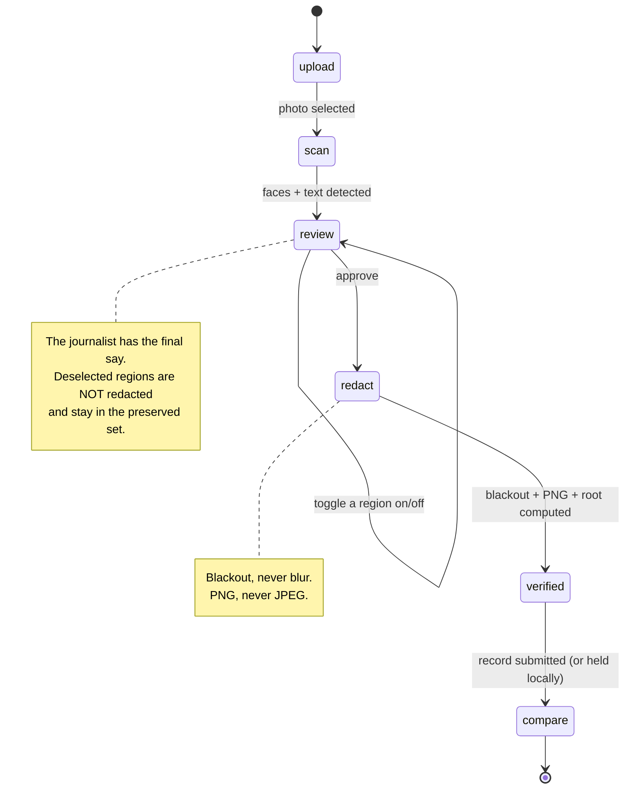

# TrueMask

**Provable redaction for journalism, on Midnight.**

## The problem

A journalist photographs a sensitive source, a witness, or a risky scene. Modern AI can work out
**where** a photo was taken from background detail alone — faces, shop signs, a recognisable
facade — with no GPS metadata involved. Publishing the picture can expose both the source and the
journalist.

Blurring the sensitive parts is not enough on its own, for two reasons:

1. **Blur is reversible.** Gaussian blur and pixelation both leak enough to be attacked.
2. **Nobody can check the rest.** A reader has no way to know whether the *unblurred* part of the
   picture is the real scene or has been quietly edited — and the journalist cannot prove it is,
   because proving it would mean handing over the original.

## The solution

The journalist drops the photo into TrueMask before publishing. Everything happens on their machine:

- faces are found with **MediaPipe**, signs and plates and documents with **Tesseract OCR**;
- every detected region is blacked out **irreversibly** and exported as a **lossless PNG**;
- the image is cut into a fixed grid, and a cryptographic root is computed over every block that
  was *not* redacted;
- a **zero-knowledge circuit on Midnight** records that root, asserting that the untouched blocks of
  the published image hash identically to the same blocks of the original.

The original image never leaves the machine. Anyone holding the published photo can later re-run the
same block hashing and check it against the chain: if a single pixel outside the redactions has
changed, the roots diverge and verification fails.

> **One-line pitch:** we protect journalists and their sources from being identified by AI
> geolocation, with mathematical proof that the protection was real.

---

## What is actually built

| Area | Status |
|---|---|
| Compact contract (`submit_redaction`, `verify_integrity`, `compute_preserved_root`) | **Working** — compiles, 10 tests |
| Vision pipeline (grid, block hashing, root, bitmap, blackout redaction) | **Working** — 41 tests |
| Prover/verifier hash agreement (TS root == compiled circuit root) | **Working** — pinned by test |
| Tamper detection (one altered pixel fails verification) | **Working** — covered end to end |
| `TrueMaskAPI` (deploy / join / submit / verify) | **Working**, typechecked and built |
| Next.js UI wired to the real pipeline and the real contract | **Working** — builds and runs |
| Face + text detection in the browser | **Implemented**, not automatically testable (browser-only) |
| Protected image displayed + downloadable as PNG | **Working** |
| Wallet connection, on-chain submission | **Implemented, unverified** — needs Lace + node + indexer |
| Local devnet (node + indexer) | **Not set up** — documented below |

### What the proof does and does not establish

It establishes **tamper-evidence**: once a redaction is registered, any later change to a block that
was not authorized for redaction breaks the stored root, and `verify_integrity` fails. It also binds
the image to a declared redaction policy through a commitment to the authorization bitmap.

It does **not** establish that the journalist was honest about which original they started from.
Both roots are supplied by the prover. That limit is inherent to committing to an image only the
prover holds, and it is stated here rather than glossed over.

---

## Architecture


### Why the image is split into blocks

A ZK circuit cannot hash a whole photo — Compact unrolls every loop, and `persistentHash` is SHA-256,
which is expensive in-circuit. A 1920×1080 photo is 8160 blocks; hashing each one inside the circuit
is not viable.

So the reduction happens outside the circuit and lands on a **fixed width**:

```
leaf_i = SHA256("truemask:leaf:v1"  || cols,rows,blockSize,i || block pixels)   for every preserved block
lane_j = SHA256("truemask:lane:v1"  || cols,rows,blockSize,j || leaf_i ‖ …)     for i % 16 == j
root   = persistentHash<Vector<16, Bytes<32>>>(lane_0 … lane_15)               <- in the circuit
```

The circuit's cost is therefore constant no matter how large the photo is. The block index and the
grid dimensions are bound into every leaf, so blocks cannot be permuted and the image cannot be
reframed or resized while still matching.

**The one thing that must never drift** is the definition of that root. `compute_preserved_root` is a
`pure` circuit, so the compiler also exposes it to TypeScript as
`pureCircuits.compute_preserved_root(lanes)` — no proof, no wallet, no context. The pipeline computes
the root with WebCrypto for speed (verified byte-identical to the circuit), and
`api/src/test/integration.test.ts` asserts the two still agree. If a compiler version ever changes
that encoding, a test fails loudly instead of proofs silently never verifying.

### The user's path through the app



---

## Repository layout

```
contract/            Compact contracts + their TypeScript bindings
  truemask.compact     the redaction-integrity contract  <- the product
  leaderboard.compact  an unrelated tutorial contract kept from the template
  managed/             compiled circuits, proving keys, zkir (committed on purpose)
  src/                 CompiledTrueMaskContract + witness implementations
  test/                circuit tests
api/                 Platform-agnostic logic
  src/vision/          detection, block splitting, hashing, redaction
  src/index.ts         TrueMaskAPI — deploy / join / submitRedaction / verifyIntegrity
  src/test/            vision unit tests + vision-to-circuit integration tests
truemask/apps/web/   Next.js 16 frontend
  src/hooks/useMidnight.ts   wallet connection + the six Midnight providers
  src/components/            the UI
proof-server/        docker-compose for the proof server
scripts/             e2e-truemask.mjs — full chain trace, no browser needed
_archive/            superseded files, kept for history, never built
```

---

## Setup

### Prerequisites

| Tool | Version | Notes |
|---|---|---|
| Node.js | 22+ | the pipeline uses `crypto.subtle` |
| Docker | any recent | for the proof server |
| Compact CLI | 0.5.2 with compiler **0.31.1** | only needed to recompile the contract |

The compiler is pinned: `leaderboard.compact` declares `pragma language_version 0.23` exactly, and the
workspace pins `@midnight-ntwrk/compact-runtime@0.16.0`. Compiling one contract with a newer toolchain
desynchronises the workspace. Install the pinned compiler with `compact update 0.31.1`.

`contract/managed/` is **committed on purpose** — a fresh clone can build, test and run the app
without installing the Compact toolchain at all.

### 1. Install

```bash
npm install          # installs all three workspaces: contract, api, truemask/apps/web
```

### 2. Start the proof server

```bash
npm run proof-server                         # docker compose up -d
curl http://localhost:6300/health            # -> {"status":"ok", ...}
```

### 3. Compile the contract *(optional — `managed/` is committed)*

```bash
npm run compile      # compact compile +0.31.1 for both contracts
```

### 4. Build

```bash
npm run build        # contract -> dist, api -> dist
```

### 5. Test

```bash
npm test             # 33 contract tests + 48 api tests
npm run e2e          # full chain trace against the real compiled circuits
```

### 6. Run the app

```bash
npm run dev          # http://localhost:3000
```

`npm run dev` first runs `sync:zk`, which copies `contract/managed/truemask` into
`truemask/apps/web/public/midnight/truemask`. The browser fetches prover keys from there — the layout
(`keys/<circuit>.prover`, `zkir/<circuit>.bzkir`) is exactly what `FetchZkConfigProvider` expects.
That copy is gitignored; `contract/managed/` remains the source of truth.

### 7. On-chain submission (not yet exercised)

Generating and submitting a real transaction additionally needs:

- the **Midnight Lace** browser extension,
- a **node** on `:9944` and an **indexer** on `:8088`.

Neither is running in this repo yet. Point the app at them with:

```bash
# truemask/apps/web/.env.local
NEXT_PUBLIC_NETWORK_ID=undeployed
NEXT_PUBLIC_INDEXER_URI=http://127.0.0.1:8088/api/v1/graphql
NEXT_PUBLIC_INDEXER_WS_URI=ws://127.0.0.1:8088/api/v1/graphql/ws
NEXT_PUBLIC_PROOF_SERVER_URI=http://localhost:6300
NEXT_PUBLIC_CONTRACT_ADDRESS=            # leave empty to deploy a fresh registry
```

Without a wallet the app still runs the full local pipeline and shows the hashes — it just holds the
record locally instead of publishing it.

---

## Known gaps

These are real and deliberate, not oversights:

1. **The wallet adapter in `useMidnight.ts` has not been exercised.** Every import and signature was
   checked against the installed `.d.ts` files, but the wallet speaks in serialized transaction
   strings while `WalletProvider` speaks in ledger objects, and that boundary needs a live Lace
   wallet to confirm. It is isolated in one function and flagged in the source.
2. **No devnet.** See step 7 above.
3. **Detection quality has no unit tests.** MediaPipe and Tesseract are browser-only. It has been
   verified end to end in a real headless browser (full-range BlazeFace, 2x2 tiled, 10 regions found
   on a wide café photo), but there is no automated regression test — everything downstream of the
   detectors does have one. There is **no licence-plate detector**; plates are covered incidentally
   by OCR reading the characters on them as text.
4. **Large photos are slow.** Hashing is proportional to pixel count and runs on the main thread:

   | image | blocks | `redactImage` total |
   |---|---|---|
   | 640x480 | 1,200 | ~0.5 s |
   | 1920x1080 | 8,160 | ~2.0 s |
   | 4032x3024 (12 MP) | 47,628 | ~8.6 s |

   Blocks are hashed in batches and the loop yields between them, so the tab stays responsive and a
   progress percentage is shown, but a 12 MP upload still takes several seconds. Moving the pipeline
   into a Web Worker is the fix; it was not needed for the demo.
5. **The contract workspace is still named `leaderboard-contract`** and still carries the unrelated
   tutorial contract from the template. Renaming touches every import, so it was left alone.

## Check which checkout you are running

In development the page prints the serving directory in the bottom-left corner. A stale `next dev`
from an unrelated copy of this project once held `:3000` for hours, and its hardcoded demo detections
were mistaken for broken MediaPipe output. If that badge does not say
`.../TrueMask/truemask/apps/web`, you are looking at a different project:

```bash
ss -ltnp | grep :3000     # find what owns the port
pkill -f next-server      # then: npm run dev, from this repo
```
