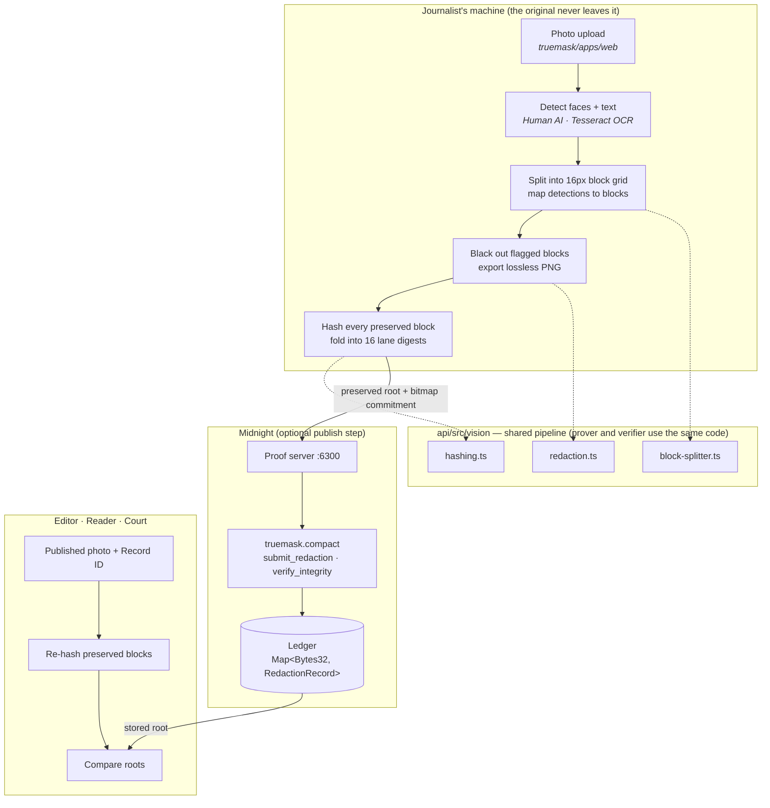

# TrueMask

**Privacy-preserving image redaction, backed by a zero-knowledge proof on Midnight.**

> *We protect journalists and their sources from being identified by AI geolocation — with mathematical proof that the protection was real.*

---

## The problem

A journalist photographs a sensitive source, a witness, or a dangerous scene. Modern AI can figure out *where* a photo was taken just from background details — faces, shop signs, a street name, a recognisable building — without needing any GPS data in the file. Publishing the picture can expose both the source and the journalist.

Blurring or pixelating the sensitive parts is not enough on its own, for two reasons:

1. **Blurring is reversible.** Gaussian blur and pixelation both leak enough signal to be partially reversed with off-the-shelf tools.
2. **The "safe" parts can't be verified.** A reader has no way to know whether the unblurred area of the picture is the real scene or has been quietly edited. The journalist can't prove it either — because proving it would require handing over the original, which defeats the purpose.

---

## The solution

TrueMask turns redaction into something you can *prove*, not just trust. Everything runs on the journalist's own machine:

1. Faces are found by **[Human](https://github.com/vladmandic/human)** — a browser-side AI model running entirely in WebAssembly.
2. Text on signs, ID badges, number plates, and documents is found by **[Tesseract OCR](https://github.com/naptha/tesseract.js)** — also running in the browser.
3. Every detected region is blacked out **irreversibly** and exported as a lossless PNG.
4. The image is split into a fixed 16×16 pixel block grid. A cryptographic hash is computed over every block that was **not** redacted.
5. A **zero-knowledge circuit on [Midnight](https://midnight.network)** records those hashes, asserting that the untouched blocks of the published image are identical to the same blocks in the original.

**The original image never leaves the device.** Anyone who later receives the published photo and its on-chain ID can re-hash it and compare — if a single pixel outside the redacted areas has changed, the roots diverge and verification fails.

---

## How it works — step by step

```
Original photo  (stays on your machine, always)
       │
       ▼
   AI Detect ──▶ Black out ──▶ Hash preserved blocks ──▶ ZK circuit (Midnight)
                                                                  │
                                              Published record (optional, on-chain)
                                                                  │
Published photo + Record ID ──▶ Re-hash ──▶ Compare ──▶ Match / No match
```

| Step | What happens | Where |
|---|---|---|
| Upload | Journalist drops in the original photo | Browser |
| Detect | Human AI finds faces; Tesseract finds text | Browser (WebAssembly) |
| Review | Journalist sees bounding boxes, can remove or add regions manually | Browser |
| Redact | Flagged regions are blacked out, lossless PNG exported | Browser |
| Commit | Image split into blocks, ZK circuit records the root | Midnight chain |
| Verify | Anyone re-hashes the published photo and checks against the record | Browser (no wallet needed) |

---

## What is actually built

| Area | Status |
|---|---|
| Compact ZK contract (`submit_redaction`, `verify_integrity`) | ✅ Working — compiles, 10 tests pass |
| Vision pipeline (grid, hashing, root, bitmap, blackout) | ✅ Working — 41 tests pass |
| Prover / verifier hash agreement (TypeScript root = circuit root) | ✅ Working — pinned by test |
| Tamper detection (one altered pixel breaks verification) | ✅ Working — covered end-to-end |
| `TrueMaskAPI` (deploy / join / submit / verify) | ✅ Working — type-checked and built |
| Next.js UI wired to the real pipeline and contract | ✅ Working — builds and runs |
| Face detection with tight bounding boxes (Human AI) | ✅ Working — browser only |
| Text detection (Tesseract OCR) | ✅ Working — browser only |
| Manual region drawing (add or remove boxes by hand) | ✅ Working |
| Protected image displayed and downloadable as PNG | ✅ Working |
| Wallet connection and on-chain submission | ✅ Implemented — blocked by a documented Preprod network issue (see Known gaps) |
| Local devnet (node + indexer + proof server) | ⚠️ Not set up — documented below |

### What the proof guarantees (and what it doesn't)

**It does guarantee:** Once a redaction is registered, any later change to a block that was *not* redacted breaks the stored root, and `verify_integrity` fails. The redaction policy (which areas were redacted) is also committed, so it can't be silently changed later.

**It does not guarantee:** That the journalist was honest about which original image they started from. Both roots are provided by the prover — this is an inherent limit of committing to an image only the prover holds, and it is stated here clearly rather than glossed over.

---

## Architecture



---

## Repository layout

```
contract/            Compact smart contract + compiled output
  src/               Contract source + witness implementations
  managed/truemask/  Pre-compiled output (committed — no Compact toolchain needed)
  test/              Circuit tests
api/                 Platform-agnostic TypeScript logic (shared by browser and Node)
  src/vision/        Detection, block splitting, hashing, redaction
  src/index.ts       TrueMaskAPI — deploy, join, submitRedaction, verifyIntegrity
  src/test/          Vision unit tests + vision-to-circuit integration tests
truemask/apps/web/   Next.js 16 frontend
  src/hooks/useMidnight.ts   Wallet connection + all six Midnight providers
  src/components/            UI components
  src/workers/               Web Worker for off-thread image hashing
proof-server/        Docker Compose for the local proof server
testing/             e2e test script + full test strategy documentation
```

---

## Setup

Run these steps in order the first time. Each one builds on the last.

### Prerequisites

| Tool | Minimum version | Notes |
|---|---|---|
| Node.js | 22+ | The pipeline uses `crypto.subtle`, which requires Node 22 |
| Docker | Any recent | Required to run the local proof server |
| Compact CLI | `0.5.2` with compiler `0.31.1` | Only needed if you want to **recompile** the contract |

> **Note on the Compact version:** The workspace pins `@midnight-ntwrk/compact-runtime@0.16.0`. Compiling with a newer compiler than that runtime expects will desynchronise the workspace. Install the pinned compiler with `compact update 0.31.1`.
>
> `contract/managed/` is committed on purpose — a fresh clone can build, test, and run the app without installing the Compact toolchain at all.

### 1. Install dependencies

```bash
npm install
```

This installs all three workspaces: `contract`, `api`, and `truemask/apps/web`.

### 2. Start the proof server

```bash
npm run proof-server
curl http://localhost:6300/health   # should return {"status":"ok", ...}
```

### 3. (Optional) Recompile the contract

The compiled output is already committed, so skip this unless you've changed the contract source.

```bash
npm run compile
```

### 4. Build

```bash
npm run build
```

Builds `contract → dist` and `api → dist`.

### 5. Run tests

```bash
npm run test:all    # 10 contract tests + 41 api tests + the e2e trace
```

See [`testing/README.md`](testing/README.md) for what each layer tests and how to run them individually.

### 6. Run the app

```bash
npm run dev
# Open http://localhost:3000
```

`npm run dev` runs `sync:zk` first, which copies `contract/managed/truemask` into `truemask/apps/web/public/midnight/truemask`. The browser fetches prover keys from there. That copy is gitignored — `contract/managed/` is always the source of truth.

---

## Publishing to Midnight (Preprod)

Everything up to this point — detecting, redacting, hashing, verifying offline — happens with no network connection at all. Publishing is the one step that writes to the Midnight ledger.

1. Install **[Midnight Lace](https://midnight.network/lace)** and switch it to **Preprod** (or use **[1AM](https://1am.xyz)** — the app supports any wallet that implements the Midnight DApp Connector API).
2. Request **tNIGHT** for your *unshielded* address at <https://faucet.preprod.midnight.network/>. The faucet does not hand out tDUST directly.
3. **Delegate** that tNIGHT in the wallet to start generating **tDUST**. Give it a minute or two to accrue. tDUST is what actually pays the transaction fee.
4. Start the proof server: `npm run proof-server`. Proving runs locally even on a public network — this is what keeps the original image on your machine.
5. Run `npm run dev`, protect an image, and press **Publish to Midnight** on the record screen.
6. The **first** publish deploys the contract and shows its address. Copy it into `NEXT_PUBLIC_CONTRACT_ADDRESS` in `truemask/apps/web/.env.local`. Future runs will join that contract instead of deploying a new one, and the Verify flow will confirm records against the chain.

See `truemask/apps/web/.env.example` for all available settings.

> **Verifying never needs any of this.** It is a read-only operation — no wallet, no fee, no setup required. With a contract address configured, it confirms the record against Midnight; without one, it verifies offline and tells you so.

---

## AI models

| Detector | Library | What it finds | Runs where |
|---|---|---|---|
| Face detection | [`@vladmandic/human`](https://github.com/vladmandic/human) | Human faces — tight bounding box over facial features only | Browser (WebGL / WASM) |
| Text / OCR | [`tesseract.js`](https://github.com/naptha/tesseract.js) | Text on signs, number plates, ID badges, documents | Browser (WASM) |

Both models run entirely in the browser — no image data is ever sent to an external server. The face model automatically falls back from WebGL to WebAssembly if the browser doesn't support WebGL. On first use, both models download their weight files (~20 MB total); subsequent runs use the browser cache.

**What is not detected automatically:** Generic accessories such as unique jewellery, tattoos, or clothing patterns. These can be added manually using the region-drawing tool in the Review step.

---

## Known gaps

No project this size ships complete. Here is what is still rough and why.

### 1. Preprod network reliability

Publishing was tested end-to-end against real Preprod infrastructure and ran into a network-wide issue — not a bug in this code. A funded wallet, faucet-funded tNIGHT, and tDUST generation all worked right up to proof submission, where it hung indefinitely with no error. We ruled out our own stack: Docker logs were clean, the local proof server was healthy, and we tried multiple configurations. The symptom matches a failure that another hackathon team documented publicly — every HTTP endpoint healthy, only the RPC **WebSocket** rejecting connections.

Because a hanging connection would freeze the UI, `publishRecord()` now bounds every wallet call with a timeout (20 s to connect, 60 s to publish) and shows a **Cancel** button. A stuck attempt turns into a clear error message rather than an unresponsive spinner.

### 2. No local devnet

The wallet flow requires a running Midnight node + indexer + proof server. See [Publishing to Midnight](#publishing-to-midnight-preprod) above.

### 3. Detection has no automated tests

Both detectors (Human AI and Tesseract) are browser-only (WebAssembly + canvas) and cannot run in this Node-based test suite. Everything *downstream* of a detection — bounding boxes, block mapping, hashing, redaction — is fully covered by the vision-pipeline tests. The detectors themselves were validated by hand in a real browser with representative images.

### 4. Large photos are slow to hash

Hashing is proportional to pixel count. Rough timings on a mid-range laptop:

| Image size | Blocks | Time |
|---|---|---|
| 640 × 480 | ~1,200 | ~0.5 s |
| 1920 × 1080 | ~8,100 | ~2.0 s |
| 4032 × 3024 (12 MP) | ~47,600 | ~8.6 s |

The loop yields between batches so the tab stays responsive and a progress percentage is shown, but large uploads still take several seconds.

---

## Troubleshooting

**The app shows a blank screen or crashes on startup**
Run `npm run build` first. The `api` package must be compiled before the web app can import it.

**Port 3000 is already in use**
```bash
ss -ltnp | grep :3000   # find what owns the port
pkill -f next-server     # stop it, then re-run npm run dev
```

**"Could not decode the selected image"**
The file is either corrupted or in an unsupported format. Use a real JPEG or PNG file.

**Faces are not being detected**
On the first scan, the AI model downloads ~20 MB of weight files from the CDN. The UI shows a "Loading AI model" indicator during this phase. If detection still fails after loading, try a higher-resolution image — the detector needs at least ~15 pixels of face area to fire.

**The proof server health check fails**
Make sure Docker is running: `docker info`. Then re-run `npm run proof-server`.

---

## License

MIT — [Webisoft Development Labs](https://webisoft.com)
