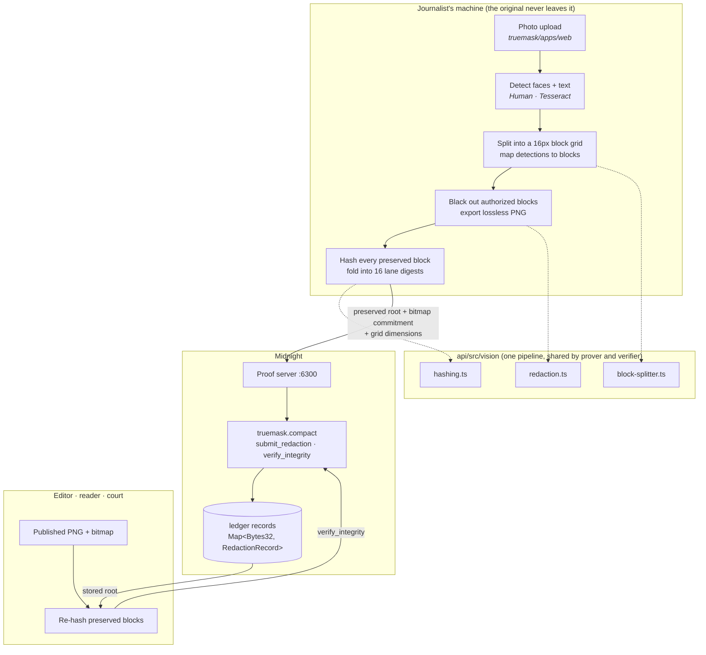
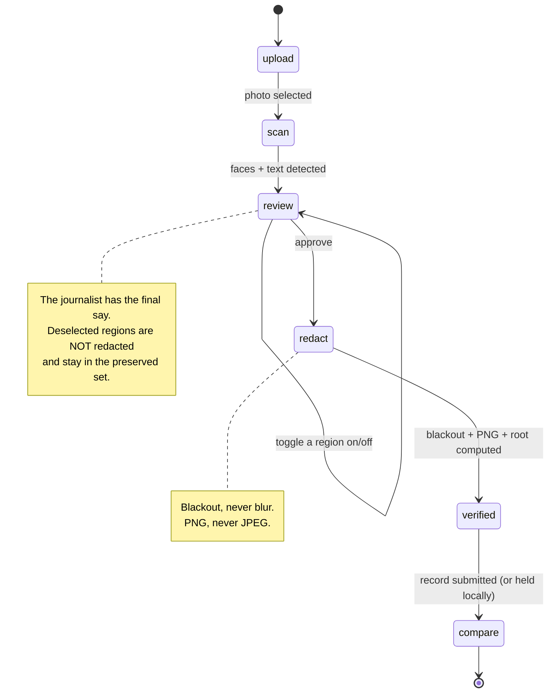

# TrueMask

**Provable redaction for journalism, on Midnight.**

## The problem

A journalist photographs a sensitive source, a witness, or a risky scene. Modern AI can now work
out where a photo was taken just from background detail: faces, shop signs, a recognisable facade,
no GPS metadata needed. Publishing the picture can expose both the source and the journalist.

Blurring the sensitive parts is not enough on its own, for two reasons:

1. **Blur is reversible.** Gaussian blur and pixelation both leak enough to be attacked.
2. **Nobody can check the rest.** A reader has no way to know whether the *unblurred* part of the
   picture is the real scene or has been quietly edited, and the journalist cannot prove it is,
   because proving it would mean handing over the original.

## The solution

TrueMask closes that gap by turning redaction into something you can check, not just trust. The
journalist drops the photo in before publishing, and from that point on, everything happens on
their own machine:

- faces are found with **Human** (a browser-side ML model), signs and plates and documents with
  **Tesseract OCR**;
- every detected region is blacked out **irreversibly** and exported as a **lossless PNG**;
- the image is cut into a fixed grid, and a cryptographic root is computed over every block that
  was *not* redacted;
- a **zero-knowledge circuit on Midnight** records that root, asserting that the untouched blocks of
  the published image hash identically to the same blocks of the original.

The original image never leaves the machine. Anyone holding the published photo can later re-run
the same block hashing and check it against the chain. If a single pixel outside the redactions has
changed, the roots diverge and verification fails.

> **One-line pitch:** we protect journalists and their sources from being identified by AI
> geolocation, with mathematical proof that the protection was real.

---

## How it works

That's the pitch. Concretely, six steps carry a photo from upload to a record anyone can check:

1. **Upload.** The journalist drops in the original photo. It never leaves their machine.
2. **Detect.** Human finds faces, Tesseract OCR finds signs, plates, and text, both in the browser.
3. **Redact.** Every flagged region is blacked out **irreversibly**, exported as a lossless PNG.
4. **Commit.** The image is split into blocks, and a **ZK circuit on Midnight** records a root over
   every block that was *not* touched.
5. **Publish** *(optional)*. The record goes on Midnight, so anyone can verify it independently
   instead of trusting the journalist's word.
6. **Verify.** Anyone holding the published photo and its ID can re-hash it and check for a match.
   No wallet, no cost, no setup.

```
original photo (stays on device)
      │
      ▼
   detect ──▶ redact ──▶ hash preserved blocks ──▶ ZK circuit (Midnight)
                                                          │
                                          published record (optional, on-chain)
                                                          │
published photo + ID ──▶ re-hash ──▶ compare with record ──▶ match / no match
```

---

## What is actually built

That's the design. Here's how much of it is real right now, checked rather than promised:

| Area | Status |
|---|---|
| Compact contract (`submit_redaction`, `verify_integrity`, `compute_preserved_root`) | **Working**, compiles, 10 tests |
| Vision pipeline (grid, block hashing, root, bitmap, blackout redaction) | **Working**, 41 tests |
| Prover/verifier hash agreement (TS root == compiled circuit root) | **Working**, pinned by test |
| Tamper detection (one altered pixel fails verification) | **Working**, covered end to end |
| `TrueMaskAPI` (deploy / join / submit / verify) | **Working**, typechecked and built |
| Next.js UI wired to the real pipeline and the real contract | **Working**, builds and runs |
| Face + text detection in the browser | **Implemented**, not automatically testable (browser-only) |
| Protected image displayed + downloadable as PNG | **Working** |
| Wallet connection, on-chain submission | **Implemented, tested against real Preprod**, blocked by a documented Preprod infrastructure issue, not our code |
| Local devnet (node + indexer) | **Not set up**, documented below |

### What the proof does and does not establish

It establishes **tamper-evidence**: once a redaction is registered, any later change to a block
that was not authorized for redaction breaks the stored root, and `verify_integrity` fails. It also
binds the image to a declared redaction policy through a commitment to the authorization bitmap.

It does **not** establish that the journalist was honest about which original they started from.
Both roots are supplied by the prover. That limit is inherent to committing to an image only the
prover holds, and it is stated here rather than glossed over.

---

## Architecture (deep dive)

The diagram above is the whole idea in one glance. This section is for anyone who wants to see
exactly how the pieces fit. Feel free to skip ahead to [Repository layout](#repository-layout) if
you already have what you need.



### Why the image is split into blocks

A ZK circuit cannot hash a whole photo. Compact unrolls every loop, and `persistentHash` is
SHA-256, which is expensive in-circuit. A 1920×1080 photo is 8160 blocks; hashing each one inside
the circuit is not viable.

So the reduction happens outside the circuit and lands on a **fixed width**:

```
leaf_i = SHA256("truemask:leaf:v1"  || cols,rows,blockSize,i || block pixels)   for every preserved block
lane_j = SHA256("truemask:lane:v1"  || cols,rows,blockSize,j || leaf_i ‖ …)     for i % 16 == j
root   = persistentHash<Vector<16, Bytes<32>>>(lane_0 … lane_15)               <- in the circuit
```

The circuit's cost is therefore constant no matter how large the photo is. The block index and the
grid dimensions are bound into every leaf, so blocks cannot be permuted and the image cannot be
reframed or resized while still matching.

**The one thing that must never drift** is the definition of that root. `compute_preserved_root` is
a `pure` circuit, so the compiler also exposes it to TypeScript as
`pureCircuits.compute_preserved_root(lanes)`, with no proof, no wallet, and no context needed. The
pipeline computes the root with WebCrypto for speed (verified byte-identical to the circuit), and
`api/src/test/integration.test.ts` asserts the two still agree. If a compiler version ever changes
that encoding, a test fails loudly instead of proofs silently never verifying.

### The user's path through the app



---

## Repository layout

```
contract/            Compact contracts + their TypeScript bindings
  truemask.compact     the redaction-integrity contract  <- the product
  managed/             compiled circuits, proving keys, zkir (committed on purpose)
  src/                 CompiledTrueMaskContract + witness implementations
  test/                circuit tests
api/                 Platform-agnostic logic
  src/vision/          detection, block splitting, hashing, redaction
  src/index.ts         TrueMaskAPI: deploy / join / submitRedaction / verifyIntegrity
  src/test/            vision unit tests + vision-to-circuit integration tests
truemask/apps/web/   Next.js 16 frontend
  src/hooks/useMidnight.ts   wallet connection + the six Midnight providers
  src/components/            the UI
proof-server/        docker-compose for the proof server
testing/             e2e-truemask.mjs + README explaining the whole test strategy
_archive/            superseded files, kept for history, never built
```

---

## Setup

The steps below take a fresh clone to a running app. Each one builds on the last, so run them in
order the first time through.

### Prerequisites

| Tool | Version | Notes |
|---|---|---|
| Node.js | 22+ | the pipeline uses `crypto.subtle` |
| Docker | any recent | for the proof server |
| Compact CLI | 0.5.2 with compiler **0.31.1** | only needed to recompile the contract |

The compiler is pinned because the workspace pins `@midnight-ntwrk/compact-runtime@0.16.0`
(`contract/package.json`); compiling with a newer toolchain than that runtime expects
desynchronises the workspace. Install the pinned compiler with `compact update 0.31.1`.

`contract/managed/` is **committed on purpose**: a fresh clone can build, test and run the app
without installing the Compact toolchain at all.

### 1. Install

```bash
npm install          # installs all three workspaces: contract, api, truemask/apps/web
```

### 2. Start the proof server

```bash
npm run proof-server                         # docker compose up -d
curl http://localhost:6300/health            # -> {"status":"ok", ...}
```

### 3. Compile the contract *(optional, `managed/` is already committed)*

```bash
npm run compile      # compact compile +0.31.1 for both contracts
```

### 4. Build

```bash
npm run build        # contract -> dist, api -> dist
```

### 5. Test

```bash
npm run test:all     # everything: 10 contract tests + 48 api tests + the e2e trace
```

See [`testing/README.md`](testing/README.md) for what each layer proves and how to run them
individually.

### 6. Run the app

```bash
npm run dev          # http://localhost:3000
```

`npm run dev` first runs `sync:zk`, which copies `contract/managed/truemask` into
`truemask/apps/web/public/midnight/truemask`. The browser fetches prover keys from there, and the
layout (`keys/<circuit>.prover`, `zkir/<circuit>.bzkir`) is exactly what `FetchZkConfigProvider`
expects. That copy is gitignored; `contract/managed/` remains the source of truth.

### 7. Publishing to Midnight (Preprod)

Everything up to this point, redacting, hashing, verifying, happens without ever talking to a
network. Publishing is different: it's the one step that actually writes to the Midnight ledger,
and a write is a real transaction. Something has to sign it, which is what the wallet is for, and
something has to pay for it, which is what the tDUST below is for. Verifying, further down, is a
read: it costs nothing and needs nobody's permission.

1. Install **Midnight Lace** and switch it to **Preprod**.
2. Request **tNIGHT** for your **unshielded** address at
   <https://faucet.preprod.midnight.network/>. The faucet does not hand out tDUST directly.
3. **Delegate** that tNIGHT in the wallet to start generating **tDUST**, and give it a minute or
   two to accrue. tDUST is what actually pays the fee.
4. Start the proof server (`npm run proof-server`). Proving stays on your machine even on a public
   network, which is what keeps the original image local.
5. `npm run dev`, protect an image, then press **Publish to Midnight** on the record screen.
6. The first publish **deploys** the contract and shows its address. Copy it into
   `NEXT_PUBLIC_CONTRACT_ADDRESS` in `truemask/apps/web/.env.local` so later runs join that
   contract instead of deploying a new one, and so the Verify flow starts confirming records
   against the chain.

See `truemask/apps/web/.env.example` for every setting.

**Verifying never needs any of this.** It is a read: no wallet, no signing, no cost, no setup. With
a contract address configured it also confirms the record against Midnight; without one it
verifies offline and says so.

## Known gaps

No project this size ships finished. Here's what's still rough, and why it isn't a bigger deal
than it sounds.

1. **Publishing was tested end to end against real Preprod infrastructure, and it hit a
   network-wide issue, not a bug in this code.** A funded Lace wallet, a real faucet-funded tNIGHT
   balance registered for tDUST generation, and a real "Generate tDUST" transaction all worked
   right up to the point of proof generation and submission, where it hung indefinitely with no
   error. We ruled out our own stack: Docker logs were clean, our local proof server was confirmed
   healthy, and we tried both "Local" and "Remote" proof server modes, a fresh wallet, and a second
   Preprod RPC provider. The symptom matches, detail for detail, a failure that another team at
   this same hackathon documented publicly: every HTTP endpoint (node, indexer, proof server)
   healthy, only the RPC **WebSocket** rejecting connections. It's a Preprod-wide reliability
   issue, not something tied to this project or to which wallet is talking to it.

   Because a hang like that can freeze a UI mid-demo with no way out, `publishRecord()` now bounds
   every wallet call with a timeout (20 seconds to connect, 60 to publish) and offers a **Cancel**
   button, so a stuck attempt turns into a clear message instead of an unresponsive spinner. That
   message says plainly that the image is already fully protected and verifiable offline, whether
   or not the on-chain write ever completes. Wallet detection isn't locked to Lace either:
   `useMidnight.ts` looks for any wallet implementing the Midnight DApp Connector API (Lace or
   [1AM](https://1am.xyz)), in case one fares better against Preprod's WebSocket than the other.
2. **No devnet.** See step 7 above.
3. **Detection quality has no unit tests.** Face detection runs on
   [Human](https://github.com/vladmandic/human) (`@vladmandic/human`, faces only; body, hand, and
   object tracking are explicitly disabled to cut down on false positives), and text and sign
   detection runs on Tesseract OCR. Both are browser-only (WebAssembly, a canvas), so neither can
   run in this Node-based test suite. Everything downstream of a detection, from a bounding box
   onward, is fully covered by the vision-pipeline tests; the detectors themselves were checked by
   hand in a real browser instead. There is **no licence-plate detector**; plates are covered
   incidentally, by OCR reading the characters on them as text.
4. **Large photos are slow.** Hashing is proportional to pixel count and runs on the main thread:

   | image | blocks | `redactImage` total |
   |---|---|---|
   | 640x480 | 1,200 | ~0.5 s |
   | 1920x1080 | 8,160 | ~2.0 s |
   | 4032x3024 (12 MP) | 47,628 | ~8.6 s |

   Blocks are hashed in batches and the loop yields between them, so the tab stays responsive and a
   progress percentage is shown, but a 12 MP upload still takes several seconds. Moving the
   pipeline into a Web Worker is the fix; it was not needed for the demo.

## Check which checkout you are running

One practical note, since it's bitten us before mid-session: in development, the page prints the
serving directory in the bottom-left corner. A stale `next dev` from an unrelated copy of this
project once held `:3000` for hours, and its hardcoded demo detections were mistaken for broken
detector output. If that badge does not say `.../TrueMask/truemask/apps/web`, you are looking at a
different project:

```bash
ss -ltnp | grep :3000     # find what owns the port
pkill -f next-server      # then: npm run dev, from this repo
```
